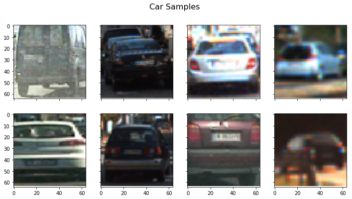
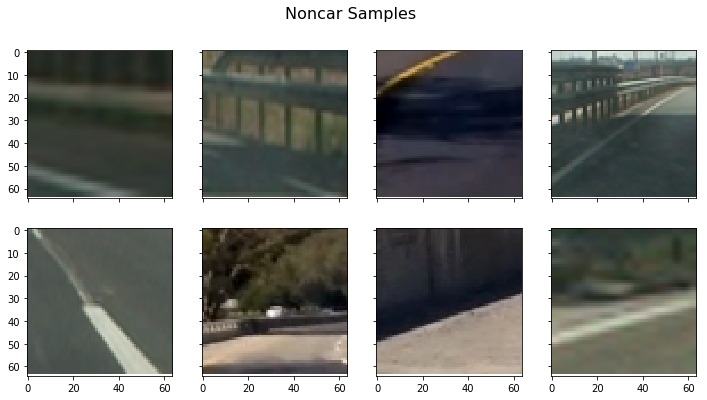
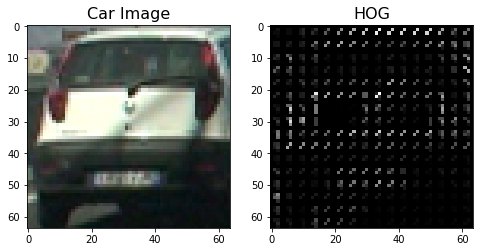
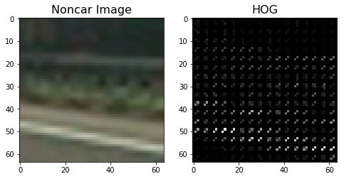
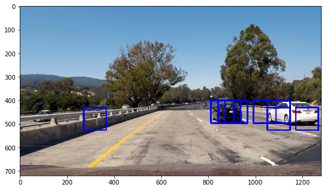
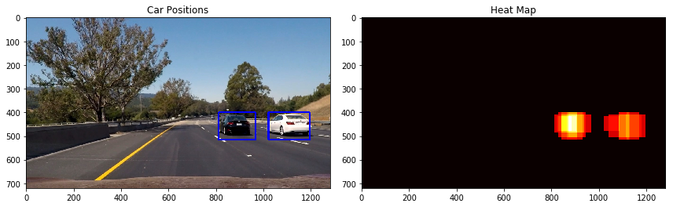
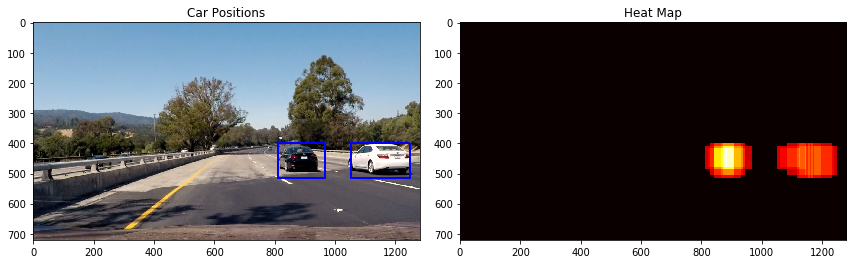
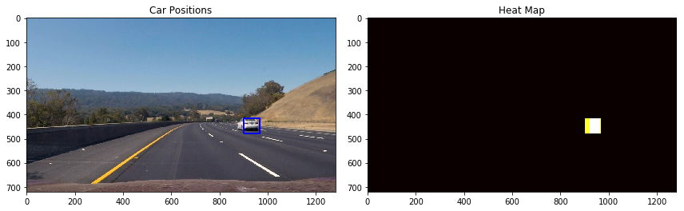
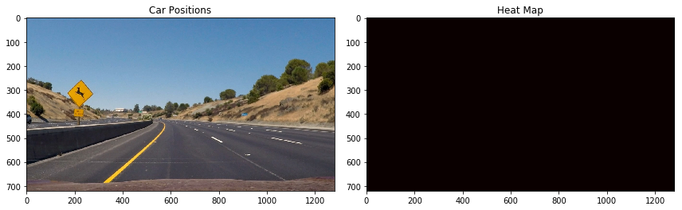
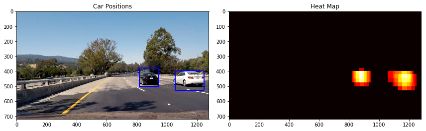

## Writeup Report

---

## [Rubric](https://review.udacity.com/#!/rubrics/513/view) Points
### Here I will consider the rubric points individually and describe how I addressed each point in my implementation.

---
### Writeup / README

#### 1. Provide a Writeup / README that includes all the rubric points and how you addressed each one.  You can submit your writeup as markdown or pdf.  [Here](https://github.com/udacity/CarND-Vehicle-Detection/blob/master/writeup_template.md) is a template writeup for this project you can use as a guide and a starting point.

You're reading it!

### Histogram of Oriented Gradients (HOG)

#### 1. Explain how (and identify where in your code) you extracted HOG features from the training images.

The code for this step is contained in blocks of "Visualize Data" and "Extract Features" of car_detection.ipynb.

I started by reading in all the `vehicle` and `non-vehicle` images.
Here are some examples of the `vehicle` and `non-vehicle` classes:

<caption>
 Fig. 1 Some Images Labeled as "Car"  
</caption>

<caption>
 Fig. 2 Some Images Labeled as "Not Car"  
</caption>

I then explored different color spaces and different `skimage.hog()` parameters (`orientations`, `pixels_per_cell`, and `cells_per_block`).
I grabbed random images from each of the two classes and displayed them to get a feel for what the `skimage.hog()` output looks like.

Here is an example using the `R` channel of the `RGB` color space and HOG parameters of `orientations=5`, `pixels_per_cell=(4, 4)` and `cells_per_block=(2, 2)`:

<caption>
 Fig. 3 HOG Features of a Car Image  
</caption>

<caption>
 Fig. 4 HOG Features of a Non-Car Image  
</caption>

#### 2. Explain how you settled on your final choice of HOG parameters.

I tried various combinations of parameters and they can be found below Section "SVM Classifier".
Basically I tried different color spaces/channels, spatial size, and different parameters of HOG.
I chose these parameter depending on the overall extracting timing and accuracy coming from a SVM.
Finally I decided to use all the YUV color channels, 10 pixels per cell with 8 orientations for HOG, down scale the image to 20 by 20 pixels, and 32 histogram bins.

#### 3. Describe how (and identify where in your code) you trained a classifier using your selected HOG features (and color features if you used them).

I tested two SVM kernels and the 'rbf' kernel seems to be superior than 'linear' kernel for a given C value.
The use of 'rbf' generally doubles the timing of fitting comparing to the corresponding 'linear' algorithm.
However it seemed a good performance required a test accuracy of greater than 99%.
As such, I decided to use SVM with 'rbf' kernel and C = 1.5.

To speed up the training and feature extraction procedures, I use only 20% of the training data (slightly more non-vehicle data).

### Sliding Window Search

#### 1. Describe how (and identify where in your code) you implemented a sliding window search.  How did you decide what scales to search and how much to overlap windows?

I modified the `find_cars()` function provided in the lectures.
In short, the function combines the feature extraction step and the sliding window search.
Moreover, HOG was only done once for the interested region of the image, while the steps for spacial and color features were performed at every sliding window.

As mentioned in the lectures, the same object looks smaller if it is far away from the camera.
To make the algorithm more efficient, I slightly increased the window scale as the image `Y` value increases.
The scaling factors are determined manually based on many tests on the test images.
Basically I used multiple windows of 1.0 and 1.5 scaling near the center region to detect cars rather far away from the camera.
The scaling factors of 2.0 and 2.5 were used for middle sized objects.
Finally two windows of 3.5 scaling were employed for objects very close to the camera.
Here is an example of the output image.

<caption>
 Fig. 5 Image Labeled with Detected Car  
</caption>

#### 2. Show some examples of test images to demonstrate how your pipeline is working.  What did you do to optimize the performance of your classifier?

Here are the test images.

<caption>
 Fig. 6a Filtered Test Image and Heatmap  
</caption>

<caption>
 Fig. 6b Filtered Test Image and Heatmap  
</caption>

<caption>
 Fig. 6c Filtered Test Image and Heatmap  
</caption>

<caption>
 Fig. 6d Filtered Test Image and Heatmap  
</caption>

There are several things I tried.
- First of all, since I have limited resources on my laptop, I tried to use a single color channel to speed up the feature extraction and training processes.
  However, the procedure was still too slow that cannot generate the project video in an hour, plus the performance is not good either.
- Next, I tried to remove some of the training data, which turned out to be very effective.
  Since there were less training data, I slightly increased the C value of SVM classifier.
- To further speed up the program, I tuned down the parameters for feature extractions.
- At this point, keeping all color channels became doable.

---

### Video Implementation

#### 1. Provide a link to your final video output.  Your pipeline should perform reasonably well on the entire project video (somewhat wobbly or unstable bounding boxes are ok as long as you are identifying the vehicles most of the time with minimal false positives.)

The output videos are located in the ``output_videos` folder.`
Here's a [link to my video result](./output_videos/project_video.mp4)

#### 2. Describe how (and identify where in your code) you implemented some kind of filter for false positives and some method for combining overlapping bounding boxes.

Note that there is a false positive in the left side of the Fig. 5.
To remove false positive, I adapted the heatmap approach given in the lecture.
First, all bounding boxes were expressed using a heatmap.
Then we filtered out boxes with overlaps fewer than a threshold.
Finally, the labels were identified by `scipy.ndimage.measurements.label()` function, which collects spatially contiguous regions of the heatmap.
The following is an example of a filtered image along with its heatmap.

<caption>
 Fig. 7 Filtered Image and Heatmap  
</caption>

To make the bounding boxes smoother from frame to frame, I kept the past 15 thresholded heatmaps which were added together and fed into `scipy.ndimage.measurements.label()` function.

---

### Discussion

#### 1. Briefly discuss any problems / issues you faced in your implementation of this project.  Where will your pipeline likely fail?  What could you do to make it more robust?

The biggest issue I faced was the slow speed of the algorithm.
As stated in the lecture, SVM is probably not suitable for large dataset and training only a small portion of the dataset indeed helped the performance.
Extracting features were also slow.
It might be possible to only apply HOG or HOG with histograms, which may further speed up the program withoutmuch sacrificing the accuracy.

Like all machine learning algorithms, the algorithm will not work if a situation is very different from the training data.
For example, a rough scan of mine suggests that there is no large trucks in the training set.
As such, I would not expect the pipeline will identify big trucks or tankers.

There are other algorithms to identify cars, like YOLO object detections based on ConvNets.
I would expect YOLO slower than sliding windows, but it might be interesting to try.
